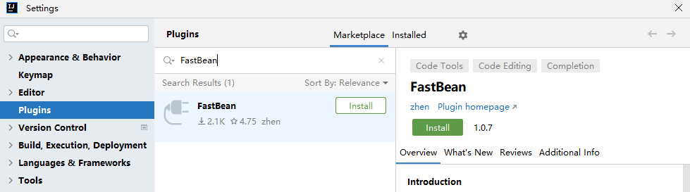
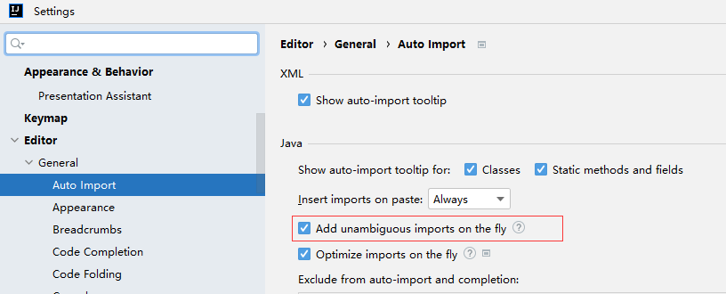
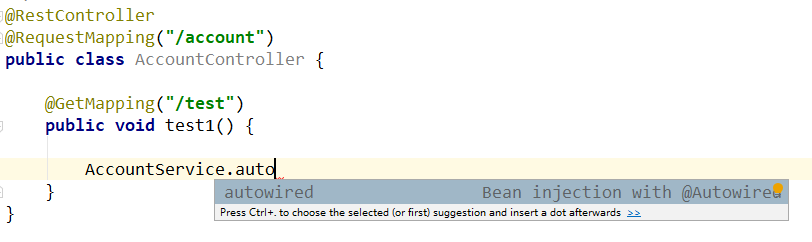
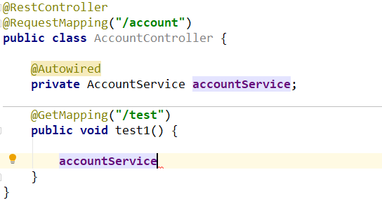
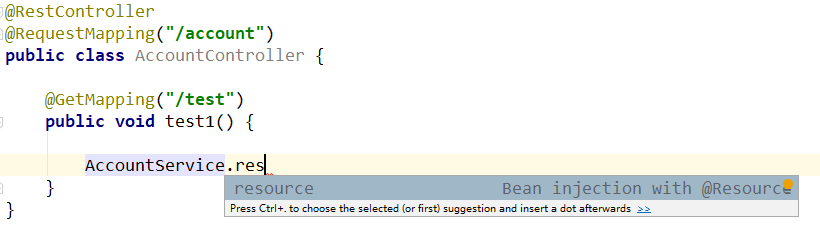
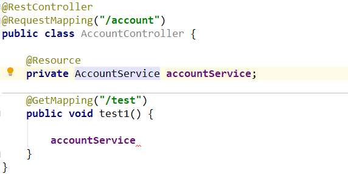
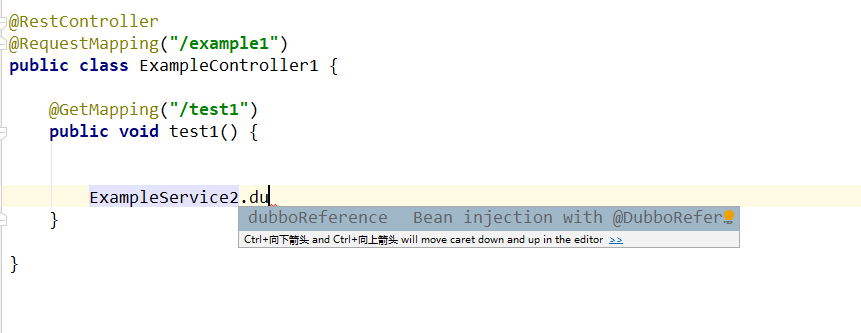
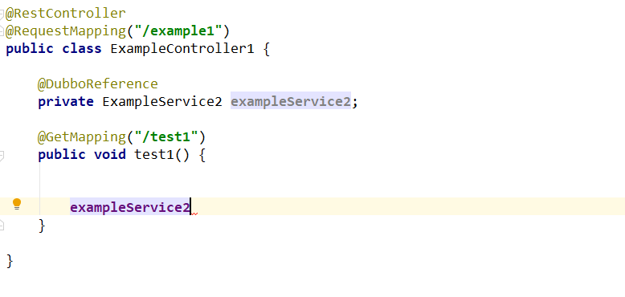
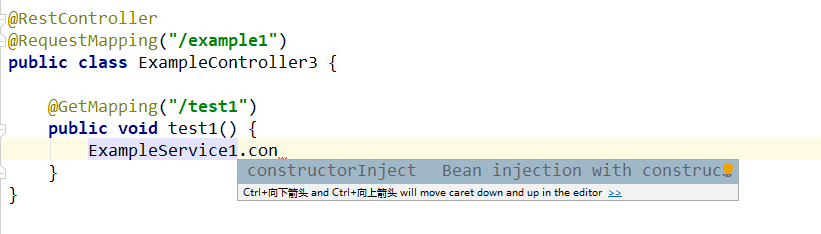
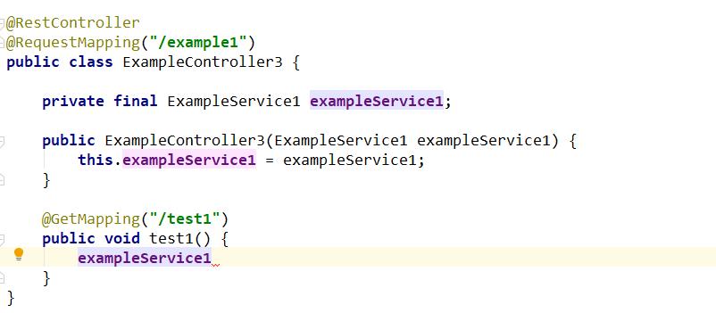

# FastBean：依赖注入提效神器

今天惊喜的发现，我编写的 idea 插件，自 2024年6月11日上线以来，已经突破 2k 下载量了。

在没有什么推广的情况下，达到这个下载量，说明这个插件还比较受欢迎，我想我有必要给大家介绍一下这款 idea 插件：[FastBean](https://plugins.jetbrains.com/plugin/24611-fastbean)

## 作用

在Spring | Spring Boot 项目中，快速注入bean。

在日常开发中，你需要在方法中使用某个依赖时，通常是先向上滑滑到类的顶部，进行依赖注入，注入完毕后，向下滑，滑倒原处，进行代码开发。

当类代码比较少，这样开发也没什么问题。

当类代码比较多，而你开发的方法距离类顶部较远，这样就不得不通过上下滑动进行依赖注入，非常繁琐，且不友好，容易打断开发思路。

这款插件就是为了解决这个痛点。

## 优势

1. 和类似功能的插件相比，更加轻量、体积小，最新版仅仅 `18.46 KB`
2. 和类似功能的插件相比，更加易于使用
3. 和类似功能的插件相比，效率更高，不会造成 IDE 卡顿
4. 兼容的 idea 版本更多（2017.3+）

## 安装

在` File | Settings | Plugins `中搜索 FastBean

点击 Install 安装插件

> 注意：需要 idea 版本 大于等于 2017.3，才可在插件市场中搜索到。

## 配置

建议在`File | Settings | Editor | General | Auto Import`中开启 idea 的自动导入功能

## 用法

- **.autowired** – 使用 @Autowired 进行 Bean 注入

  

  

- **.resource** – 使用 @Resource 进行 Bean 注入

- **.dubboReference** – 使用 @DubboReference 进行 Bean 注入

- **.constructorInject** – 使用 构造器 进行 Bean 注入

## 插件推荐

1. **[FastBean](https://plugins.jetbrains.com/plugin/24611-fastbean)**: 在Spring项目中，快速注入bean。
	
	> [让你的代码提交更优雅！FastCommit 让一切更简单_哔哩哔哩_bilibili](https://www.bilibili.com/video/BV1HLMGzgEYf)
2. **[FastCommit](https://plugins.jetbrains.com/plugin/26730-fastcommit)**: 简易的git 提交 模板建议。
	
	> [让你的代码提交更优雅！FastCommit 让一切更简单_哔哩哔哩_bilibili](https://www.bilibili.com/video/BV1HLMGzgEYf)
3. **[Fast Doc](https://plugins.jetbrains.com/plugin/27130-fast-doc)**: 基于 spring controller 方法生成 markdown 格式的接口文档
	
	> [轻量高效！FastDoc 让 API 文档生成更简单_哔哩哔哩_bilibili](https://www.bilibili.com/video/BV1n2M7zWEo3)
4. **[Go Arrow Functions](https://plugins.jetbrains.com/plugin/27297-go-arrow-functions)**: 折叠 Go 匿名函数以将其显示为类似于 Java lambda 的箭头函数。
	
	> [提升代码可读性！Go Arrow Functions 让 Go 也有箭头函数_哔哩哔哩_bilibili](https://www.bilibili.com/video/BV1HyM7zRE8k)
5. **[FastBuild](https://plugins.jetbrains.com/plugin/27467-fastbuild)**: 快速构建项目。
	
	> [FastBuild：让你的编译快人一步，效率飙升！_哔哩哔哩_bilibili](https://www.bilibili.com/video/BV1JSM7zHEY7)

## 最后

欢迎通过评论区进行 bug 的反馈和功能上的建议