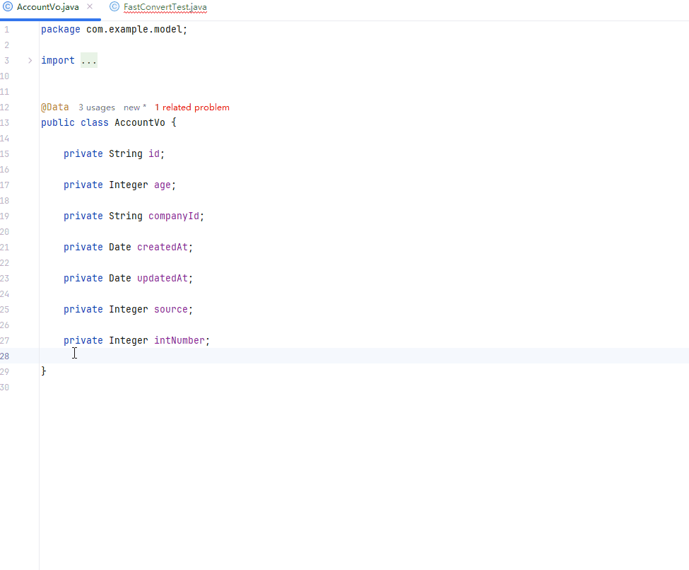
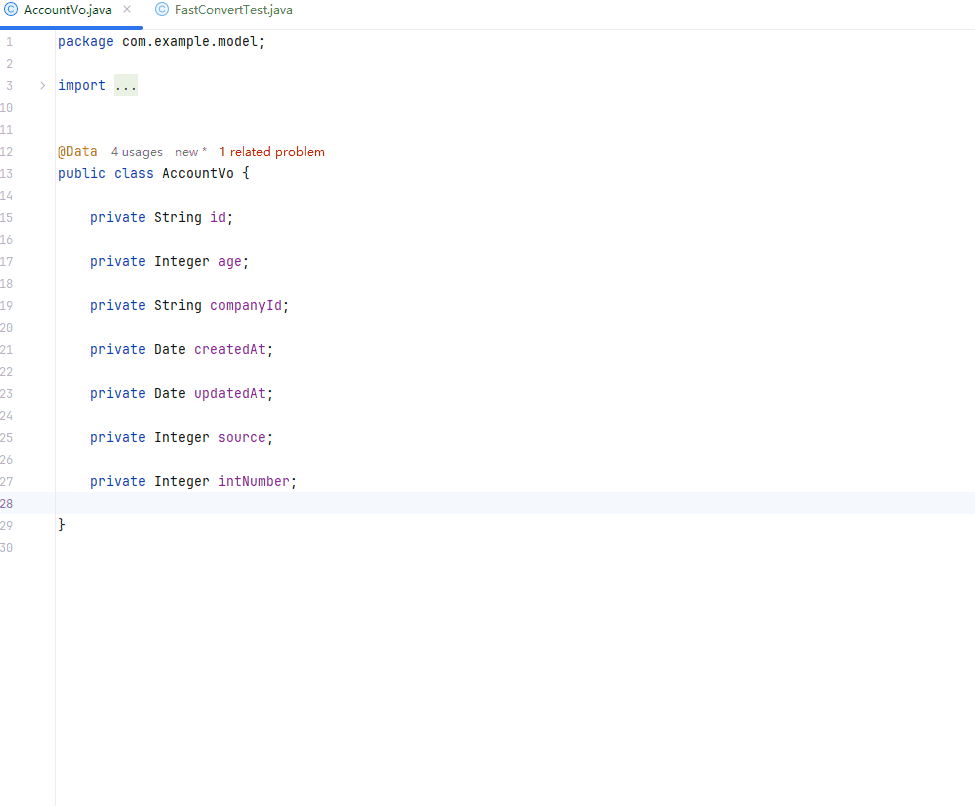
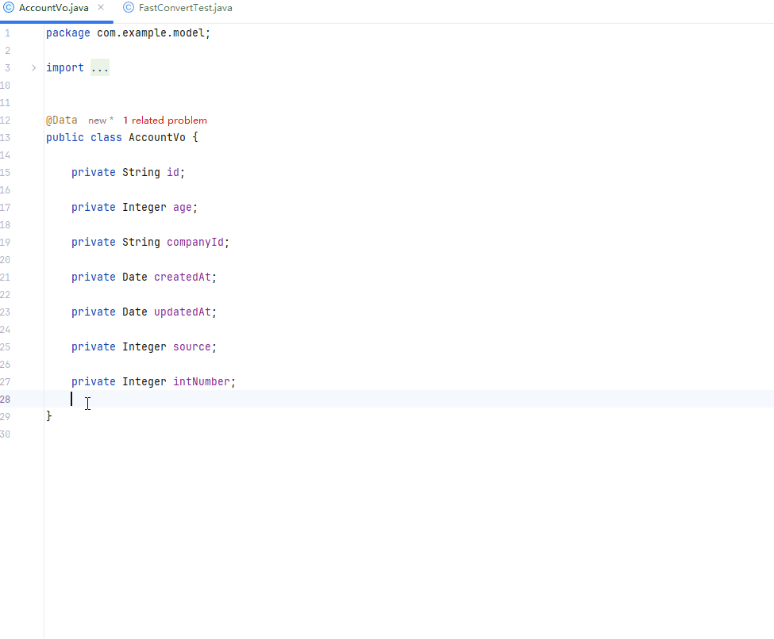

# FastConvert：告别冗长代码，体验对象转换的极速飞跃！

## 插件简介：

[FastConvert](https://plugins.jetbrains.com/plugin/28433-fastconvert) 插件旨在简化 Java 项目中对象转换的过程，解决了传统 `x.set(y.get)` 方式带来的冗长代码。该插件的功能类似于 `org.springframework.beans.BeanUtils#copyProperties` 和 `MapStruct`，可以帮助开发者高效地实现对象间的转换。

## 核心功能：

1. **自动生成对象转换方法：** 快速生成对象 `A` 到对象 `B` 的转换方法，避免手动写大量的 getter/setter。
2. **支持集合类型转换：** 支持将 `List<A>` 转换为 `List<B>`，自动生成批量转换的方法。
3. **灵活的配置设置：** 在 `Tools > FastConvert` 页面中配置实体类所在的包路径，确保插件能根据您的项目结构生成适用的转换代码。

## 使用方法：

1. **配置包路径：** 首先，在 `Tools > Fast Convert` 页面中设置实体类所在的包路径，这一步是必须的。

2. **单对象转换：** 对于实体类 `A a`，只需实时调用 `toB()` 方法，即可将 `A` 对象转换为 `B` 对象。

   

   

3. **集合对象转换：**

   - 对于 `List<A>` 对象 `a`，只需调用 `toBList()` 方法，即可将 `List<A>` 转换为 `List<B>`。
   
     
   
   - 对于 `Set<A>` 对象 `a`，只需调用 `toBSet()` 方法，即可将 `Set<A>` 转换为 `Set<B>`。
   
     

通过这款插件，开发者无需重复编写转换代码，只需简单调用方法，便可完成对象之间的高效转换，极大提升编码效率。

## 插件推荐

1. **[FastBean](https://plugins.jetbrains.com/plugin/24611-fastbean)**: 在Spring项目中，快速注入bean。

   > [让你的代码提交更优雅！FastCommit 让一切更简单_哔哩哔哩_bilibili](https://www.bilibili.com/video/BV1HLMGzgEYf)

2. **[FastCommit](https://plugins.jetbrains.com/plugin/26730-fastcommit)**: 简易的git 提交 模板建议。

   > [让你的代码提交更优雅！FastCommit 让一切更简单_哔哩哔哩_bilibili](https://www.bilibili.com/video/BV1HLMGzgEYf)

3. **[Fast Doc](https://plugins.jetbrains.com/plugin/27130-fast-doc)**: 基于 spring controller 方法生成 markdown 格式的接口文档

   > [轻量高效！FastDoc 让 API 文档生成更简单_哔哩哔哩_bilibili](https://www.bilibili.com/video/BV1n2M7zWEo3)

4. **[Go Arrow Functions](https://plugins.jetbrains.com/plugin/27297-go-arrow-functions)**: 折叠 Go 匿名函数以将其显示为类似于 Java lambda 的箭头函数。

   > [提升代码可读性！Go Arrow Functions 让 Go 也有箭头函数_哔哩哔哩_bilibili](https://www.bilibili.com/video/BV1HyM7zRE8k)

5. **[FastBuild](https://plugins.jetbrains.com/plugin/27467-fastbuild)**: 快速构建项目。

   > [FastBuild：让你的编译快人一步，效率飙升！_哔哩哔哩_bilibili](https://www.bilibili.com/video/BV1JSM7zHEY7)

6. **[TypingCat Pro](https://plugins.jetbrains.com/plugin/27744-typingcat-pro)**: 一个英语单词拼写提示与补全插件，是 TypingCat 的增强版

   > [喵力全开，拼写稳了！TypingCat Pro 上线护驾_哔哩哔哩_bilibili](https://www.bilibili.com/video/BV1F9KXzUErS)

7. **[FastConvert](https://plugins.jetbrains.com/plugin/28433-fastconvert)**: 一个自动生成对象转换方法的插件

   > [FastConvert：告别冗长代码，体验对象转换的极速飞跃！_哔哩哔哩_bilibili](https://www.bilibili.com/video/BV1NFJ2zBE2S)

## 最后

欢迎通过评论区进行 bug 的反馈和功能上的建议