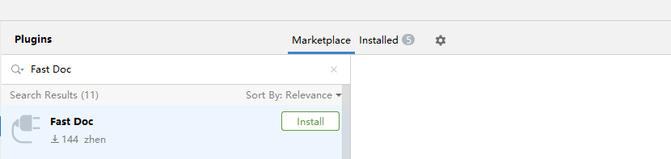
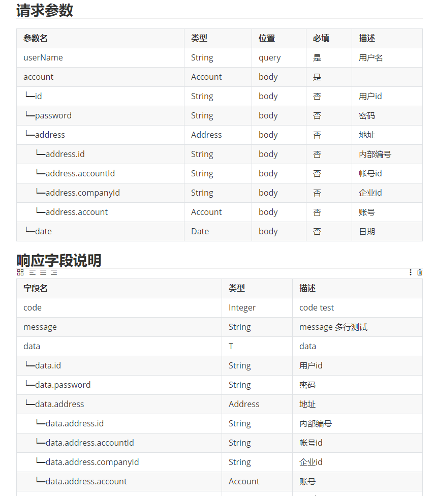

# FastDoc：让 API 文档生成更简单

今天，我想给大家介绍一款生成接口文档的 idea 插件：[FastDoc](https://plugins.jetbrains.com/plugin/27130-fast-doc)

## 作用

基于注释生成 markdown 格式的接口文档

对 spring controller 方法生成 markdown 格式的接口文档

## 优势

1. 和类似功能的插件相比，更加轻量、体积小，最新版仅仅 `25.57 KB`
2. 和类似功能的插件相比，更加易于使用
3. 和类似功能的插件相比，效率更高，不会造成 IDE 卡顿
4. 兼容的 idea 版本更多（2017.3+）

## 安装

在` File | Settings | Plugins `中搜索 Fast Doc

点击 Install 安装插件

> 注意：需要 idea 版本 大于等于 2017.3，才可在插件市场中搜索到。

## 用法

**选中 spring 项目中的 controller 方法，右键，选择 "Generate API Documentation By Fast Doc",生成 markdown 格式的接口文档**

生成的接口文档示例：

## 插件推荐

1. **[FastBean](https://plugins.jetbrains.com/plugin/24611-fastbean)**: 在Spring项目中，快速注入bean。

   > [让你的代码提交更优雅！FastCommit 让一切更简单_哔哩哔哩_bilibili](https://www.bilibili.com/video/BV1HLMGzgEYf)

2. **[FastCommit](https://plugins.jetbrains.com/plugin/26730-fastcommit)**: 简易的git 提交 模板建议。
	
	> [让你的代码提交更优雅！FastCommit 让一切更简单_哔哩哔哩_bilibili](https://www.bilibili.com/video/BV1HLMGzgEYf)
	
3. **[Fast Doc](https://plugins.jetbrains.com/plugin/27130-fast-doc)**: 基于 spring controller 方法生成 markdown 格式的接口文档
	
	> [轻量高效！FastDoc 让 API 文档生成更简单_哔哩哔哩_bilibili](https://www.bilibili.com/video/BV1n2M7zWEo3)
	
4. **[Go Arrow Functions](https://plugins.jetbrains.com/plugin/27297-go-arrow-functions)**: 折叠 Go 匿名函数以将其显示为类似于 Java lambda 的箭头函数。
	
	> [提升代码可读性！Go Arrow Functions 让 Go 也有箭头函数_哔哩哔哩_bilibili](https://www.bilibili.com/video/BV1HyM7zRE8k)
	
5. **[FastBuild](https://plugins.jetbrains.com/plugin/27467-fastbuild)**: 快速构建项目。
	
	> [FastBuild：让你的编译快人一步，效率飙升！_哔哩哔哩_bilibili](https://www.bilibili.com/video/BV1JSM7zHEY7)

## 最后

欢迎通过评论区进行 bug 的反馈和功能上的建议