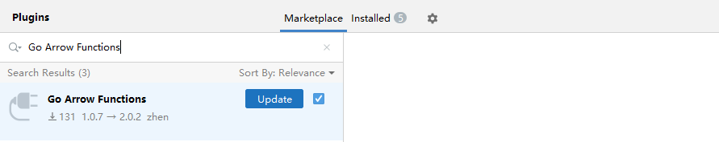
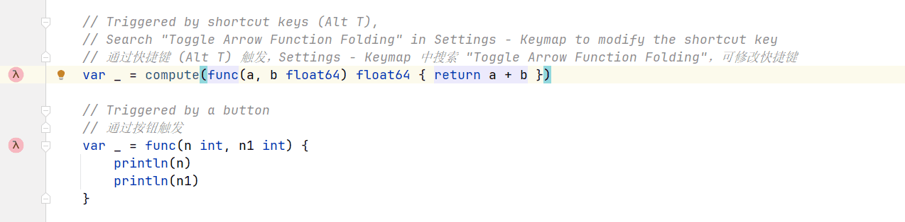
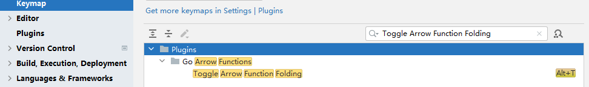
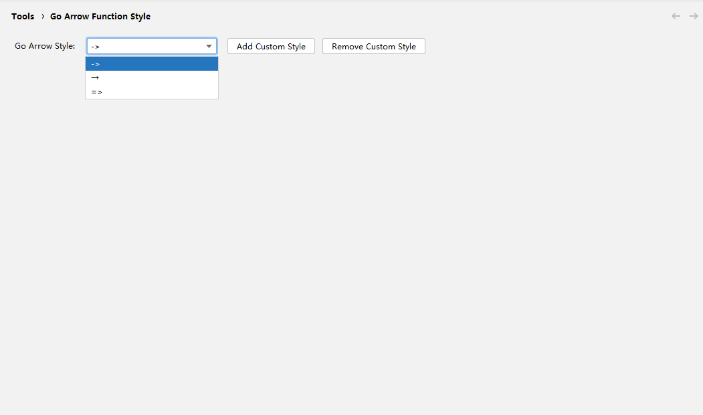

### Go Arrow Functions：提升代码可读性！ 让 Go 也有箭头函数

今天，我想给大家介绍一款对于 `Go` 语言 增加 `箭头函数` 效果的 idea 插件：[Go Arrow Functions](https://plugins.jetbrains.com/plugin/27297-go-arrow-functions)

## 作用

对go 语言 2017年的提案 [proposal: spec: lightweight anonymous function syntax · Issue #21498 · golang/go](https://github.com/golang/go/issues/21498)，提供了一种解决方案，通过 插件的方式折叠 Go 匿名函数以将其显示为类似于 Java lambda 的箭头函数。

提高代码简洁性，减少代码噪音。

## 优势

1. 和类似功能的插件相比，更加轻量、体积小，最新版仅仅 `21.99 KB`
2. 和类似功能的插件相比，更加易于使用
3. 和类似功能的插件相比，效率更高，不会造成 IDE 卡顿

## 安装

在` File | Settings | Plugins `中搜索 Go Arrow Functions

点击 Install 安装插件

> 注意：需要 idea 版本 大于等于 2024.1，才可在插件市场中搜索到。

## 用法

- **通过快捷键 (Alt T) 触发，Settings - Keymap 中搜索 "Toggle Arrow Function Folding"，可修改快捷键**
- **通过按钮触发**

## 箭头函数样式切换

如果你不喜欢默认的箭头函数样式，你也可以打开设置页面 Tools | Go Arrow Function Style，选择你喜欢的箭头函数样式

## 插件推荐

1. **[FastBean](https://plugins.jetbrains.com/plugin/24611-fastbean)**: 在Spring项目中，快速注入bean。

   > [让你的代码提交更优雅！FastCommit 让一切更简单_哔哩哔哩_bilibili](https://www.bilibili.com/video/BV1HLMGzgEYf)

2. **[FastCommit](https://plugins.jetbrains.com/plugin/26730-fastcommit)**: 简易的git 提交 模板建议。
	
	> [让你的代码提交更优雅！FastCommit 让一切更简单_哔哩哔哩_bilibili](https://www.bilibili.com/video/BV1HLMGzgEYf)
	
3. **[Fast Doc](https://plugins.jetbrains.com/plugin/27130-fast-doc)**: 基于 spring controller 方法生成 markdown 格式的接口文档
	
	> [轻量高效！FastDoc 让 API 文档生成更简单_哔哩哔哩_bilibili](https://www.bilibili.com/video/BV1n2M7zWEo3)
	
4. **[Go Arrow Functions](https://plugins.jetbrains.com/plugin/27297-go-arrow-functions)**: 折叠 Go 匿名函数以将其显示为类似于 Java lambda 的箭头函数。
	
	> [提升代码可读性！Go Arrow Functions 让 Go 也有箭头函数_哔哩哔哩_bilibili](https://www.bilibili.com/video/BV1HyM7zRE8k)
	
5. **[FastBuild](https://plugins.jetbrains.com/plugin/27467-fastbuild)**: 快速构建项目。
	
	> [FastBuild：让你的编译快人一步，效率飙升！_哔哩哔哩_bilibili](https://www.bilibili.com/video/BV1JSM7zHEY7)

## 最后

欢迎通过评论区进行 bug 的反馈和功能上的建议