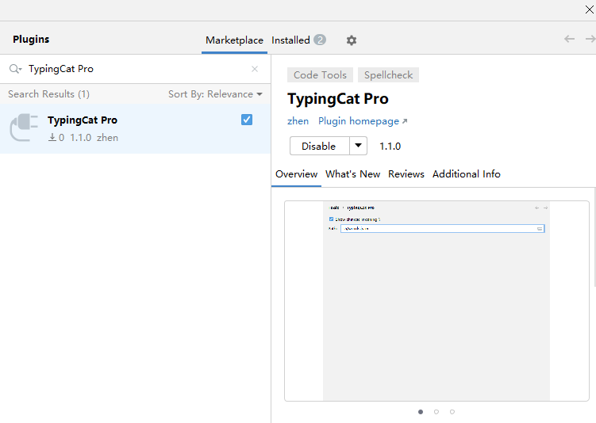
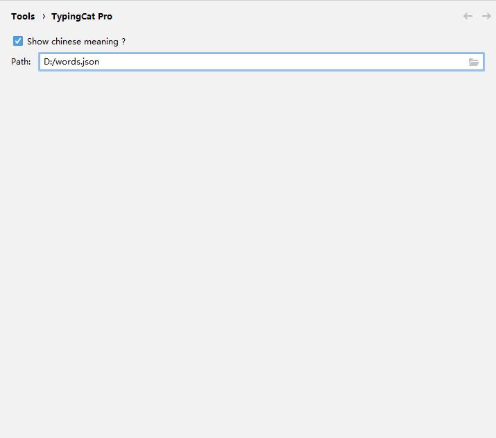
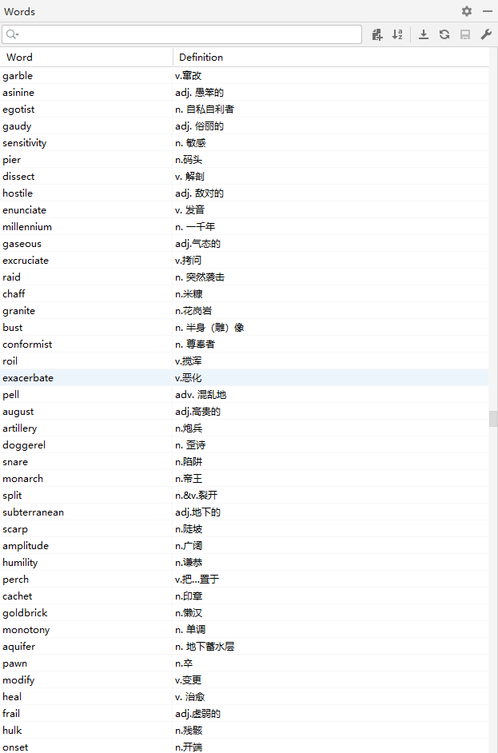
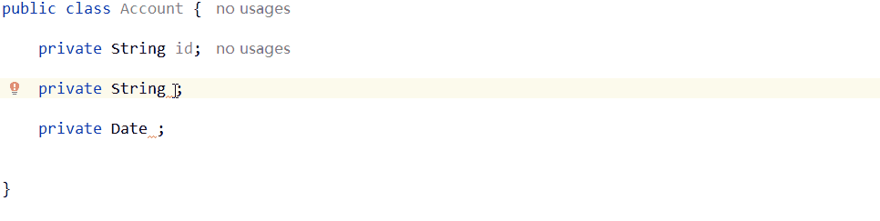

### 喵力全开，拼写稳了！TypingCat Pro 上线护驾

今天，我想给大家介绍一款对于单词拼写的 idea 插件：[TypingCat Pro](https://plugins.jetbrains.com/plugin/27744-typingcat-pro)

## 介绍

TypingCat Pro 是一个英语单词拼写提示与补全插件

TypingCat Pro 是 TypingCat 的增强版

## 优势

1. 打包体积的优化，相比于旧版打包体积降低超过 <strong>74%</strong>
2. 在存储 10,000 个单词的场景下，相比于旧版运行时内存占用降低超过 <strong>75%</strong>，检索性能与旧版本持平
3. 新增单词管理功能：支持搜索、添加、删除、编辑、排序、批量导入及自定义存储位置
4. 新增语言支持：在原有 Java、Go、Python 的基础上，新增 JavaScript、TypeScript 和 Kotlin 的支持，全面兼容 IntelliJ IDEA、Android Studio、GoLand、PyCharm、WebStorm 等 IDE
5. 新增组合词检索功能
6. 排序逻辑优化，提升推荐结果的相关性与准确性

## 安装

在` File | Settings | Plugins `中搜索 TypingCat Pro

点击 Install 安装插件

> 注意：需要 idea 版本 大于等于 2024.2，才可在插件市场中搜索到。

## 设置页面

Tools | TypingCat Pro 中可自定义单词提示是否显示中文和自定义单词本的存储位置

## 单词列表

- 支持搜索、添加、删除、编辑、排序、批量导入

- 初次使用，单词列表为空，如果需要可以下载[1万个单词列表](https://gist.githubusercontent.com/vennarshulytz/da1883a59f10ab32884815245dc7b297/raw/8585e036174b8d103165716ff71197e1b3e28bd3/words.json)，下载后，自行导入

## 使用示例

## 插件推荐

1. **[FastBean](https://plugins.jetbrains.com/plugin/24611-fastbean)**: 在Spring项目中，快速注入bean。

   > [让你的代码提交更优雅！FastCommit 让一切更简单_哔哩哔哩_bilibili](https://www.bilibili.com/video/BV1HLMGzgEYf)

2. **[FastCommit](https://plugins.jetbrains.com/plugin/26730-fastcommit)**: 简易的git 提交 模板建议。
	
	> [让你的代码提交更优雅！FastCommit 让一切更简单_哔哩哔哩_bilibili](https://www.bilibili.com/video/BV1HLMGzgEYf)
	
3. **[Fast Doc](https://plugins.jetbrains.com/plugin/27130-fast-doc)**: 基于 spring controller 方法生成 markdown 格式的接口文档
	
	> [轻量高效！FastDoc 让 API 文档生成更简单_哔哩哔哩_bilibili](https://www.bilibili.com/video/BV1n2M7zWEo3)
	
4. **[Go Arrow Functions](https://plugins.jetbrains.com/plugin/27297-go-arrow-functions)**: 折叠 Go 匿名函数以将其显示为类似于 Java lambda 的箭头函数。
	
	> [提升代码可读性！Go Arrow Functions 让 Go 也有箭头函数_哔哩哔哩_bilibili](https://www.bilibili.com/video/BV1HyM7zRE8k)
	
5. **[FastBuild](https://plugins.jetbrains.com/plugin/27467-fastbuild)**: 快速构建项目。
	
	> [FastBuild：让你的编译快人一步，效率飙升！_哔哩哔哩_bilibili](https://www.bilibili.com/video/BV1JSM7zHEY7)

6. **[TypingCat Pro](https://plugins.jetbrains.com/plugin/27744-typingcat-pro)**: 一个英语单词拼写提示与补全插件，是 TypingCat 的增强版
	
	> [喵力全开，拼写稳了！TypingCat Pro 上线护驾_哔哩哔哩_bilibili](https://www.bilibili.com/video/BV1F9KXzUErS)

## 最后

欢迎通过评论区进行 bug 的反馈和功能上的建议